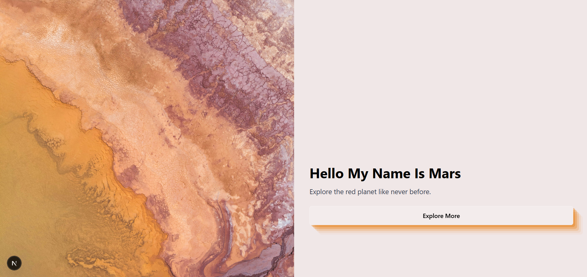

# 🌌 Marte - Plantilla Next.js

Bienvenido a **Marte**, una plantilla mockup lista para ser personalizada. Forma parte de una serie de templates inspirados en los planetas del sistema solar. Esta plantilla está construida con **Next.js, Tailwind CSS y TypeScript** y está licenciada bajo **MIT**.

## 🚀 Características

- ⚡ **Framework Next.js** para sitios web basados en React.
- 🎨 **Diseño personalizable** con **Tailwind CSS**.
- 🛠 **Modular y escalable** con una estructura de archivos optimizada.
- 📄 **Código limpio y bien documentado** para facilitar la personalización.

## 📦 Instalación

Clona el repositorio y ejecuta los siguientes comandos:

```sh
git clone https://github.com/tu-usuario/tu-repositorio.git
cd tu-repositorio
npm install
```

## 🧞 Comandos Disponibles

| Comando                | Acción                                       |
| ---------------------- | -------------------------------------------- |
| `npm install`          | Instala las dependencias                     |
| `npm run dev`          | Inicia el servidor local en `localhost:4321` |
| `npm run build`        | Genera la versión de producción en `./dist/` |
| `npm run preview`      | Previsualiza la versión generada             |
| `npm run astro ...`    | Ejecuta comandos CLI de Astro                |
| `npm run astro --help` | Muestra ayuda sobre el CLI de Astro          |

## 🚀 Despliegue en GitHub Pages

Para exportar el proyecto y subirlo a **GitHub**, sigue estos pasos:

1. **Inicializa un repositorio git (si aún no lo has hecho):**
   ```sh
   git init
   git add .
   git commit -m "Primer commit"
   ```
2. **Sube el proyecto a GitHub:**
   ```sh
   git branch -M main
   git remote add origin https://github.com/tu-usuario/tu-repositorio.git
   git push -u origin main
   ```
3. **Desplegar con GitHub Pages:**
   - En tu repositorio en GitHub, ve a **Settings > Pages**.
   - Selecciona la rama `main` y la carpeta `/dist` como fuente de publicación.
   - ¡Tu sitio estará en línea en unos minutos!

## 📖 Más Información

Para más detalles, visita la [documentación oficial de Next.js](https://nextjs.org/) o únete a la [comunidad en Discord](https://discord.com/invite/nextjs).



---

🚀 **Disfruta personalizando tu plantilla Saturno y crea algo increíble!**
